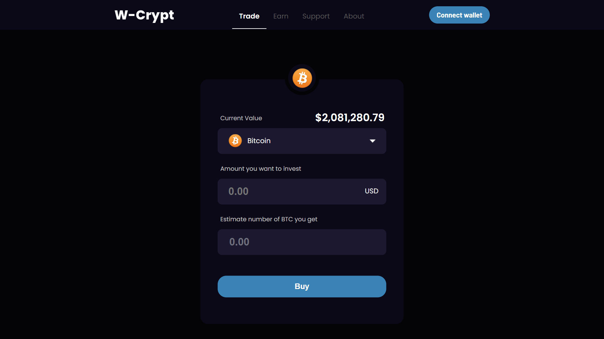

# W-crypt

Demo Link: [wcrypt.netlify.app](https://wcrypt.netlify.app)

# Screenshot

# Features

- Responsive React app that fetches real-time crypto token prices (in USD) using the Binance Websocket API.

- Animated using the Framer Motion animation library.

- Implemented functionality to allow users to select different tokens (or use the search bar), enter the amount of money he/she wants to invest, and dynamically see how many tokens they will receive after investment.
